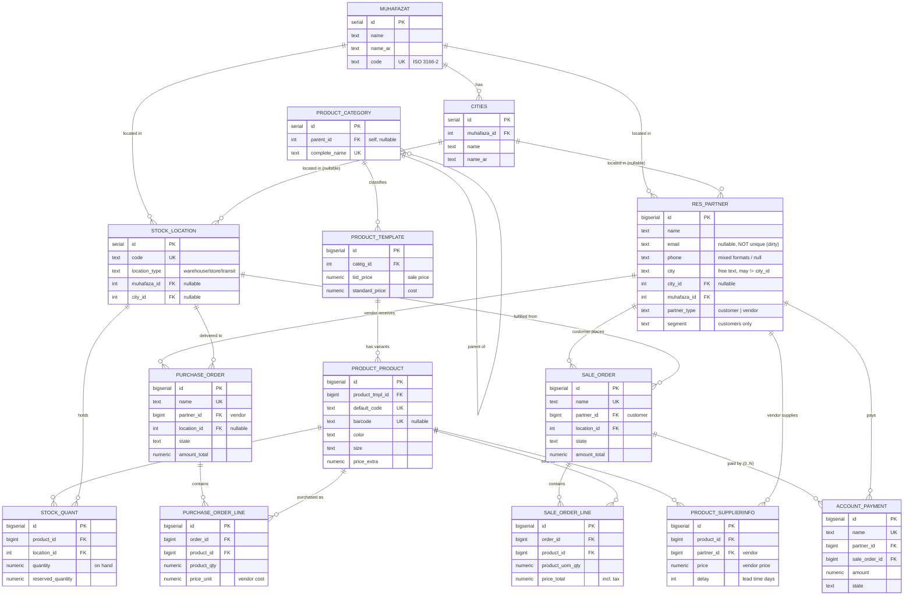

# PostgreSQL OLTP Seeding (Odoo-inspired, Egypt edition)

The **source system** for the ETL platform: a normalized OLTP schema modeled on
**Odoo's** core sales/purchase/inventory tables, seeded with realistic —
deliberately **un-cleaned** — data for an Egyptian retailer. Timestamps are
recency-weighted so the Bronze layer can demonstrate incremental extraction on
Odoo's canonical cursor, `write_date`.

## Files (run in order)

| File | Purpose |
|------|---------|
| `01_schema.sql`        | Creates the OLTP tables (schema `public`), indexes, and `write_date` triggers. **Drops and recreates these tables.** No `etl_checkpoints` — that's the pipeline owner's to add. |
| `02_seed_reference.sql`| Seeds static dimensions: `muhafazat` (27 governorates), `cities`, a 2-level `product_category` tree, and `stock_location` (idempotent). |
| `03_generate_data.sql` | Generates customers, vendors, products + variants, supplier pricelist, sales + payments, purchases, and stock. Volumes configurable. |
| `04_summary.sql`       | Row counts, distributions, and integrity/dirtiness checks. |
| `seed.sh`              | Runs all four in order using libpq env vars. |

## Data model (Odoo table names)

The source is a normalized OLTP model in the `public` schema. Every table has
`create_date` / `write_date`; a BEFORE UPDATE trigger bumps `write_date` to
`now()` — the field Odoo connectors use as the incremental cursor. Odoo
conventions are preserved: `res_partner.partner_type` (customer/vendor),
`product_category.complete_name`, `product_template` (price/cost) vs
`product_product` (variant), order `state` (draft/sent/sale/done/cancel), and
computed `amount_untaxed/tax/total`.

### Entity-relationship diagram



> All relationships are **one-to-many** (`||--o{`), i.e. a parent row can have
> zero or many children. `RES_PARTNER` is dual-role: it is the parent of
> `SALE_ORDER`/`ACCOUNT_PAYMENT` as a **customer** and of `PURCHASE_ORDER`/
> `PRODUCT_SUPPLIERINFO` as a **vendor**.

### Table-by-table

| Table | A row is… | Grain / notes |
|-------|-----------|---------------|
| `muhafazat`            | one Egyptian governorate | 27 rows; EN + AR name + ISO code |
| `cities`               | one city | belongs to exactly one governorate |
| `res_partner`          | one customer **or** vendor | `partner_type` = `'customer'` or `'vendor'`; located by governorate (+ optional city) |
| `product_category`     | one category node | 2-level tree via self `parent_id`; `complete_name` = full path |
| `product_template`     | one product concept | carries `list_price` (sale) and `standard_price` (cost) |
| `product_product`      | one **variant** of a template | 1–5 per template; color/size/`price_extra` |
| `product_supplierinfo` | one vendor↔product offer | 1–3 vendors per product, each with price + lead time |
| `stock_location`       | one physical location | flat (warehouse/store/transit), tied to a governorate/city |
| `stock_quant`          | on-hand of a variant in a location | multiple lots per (variant, location) allowed; on-hand + reserved |
| `sale_order`           | one customer sales order | header; `amount_*` rolled up from lines; a `state` |
| `sale_order_line`      | one line of a sales order | 1–5 per order; `price_total` includes tax |
| `account_payment`      | one payment against an order | **0..N** per order (full / partial / none) |
| `purchase_order`       | one vendor purchase order | header; some completed (`purchase`/`done`), some not |
| `purchase_order_line`  | one line of a purchase order | 1–5 per order; `price_unit` = vendor cost |

### What's new vs the generic version

- **Egypt geography** — `muhafazat` (governorates, EN + AR + ISO code) and
  `cities` (one governorate → many cities). `res_partner` carries `muhafaza_id`
  (always) + `city_id` (nullable) so you can slice sales/payments by governorate
  or city.
- **Real product variants** — each `product_template` fans out to 1–5
  `product_product` variants (color / size / `price_extra`).
- **Vendor pricelist** — `product_supplierinfo` links 1–3 vendors to each
  product with a price + lead time; purchase-order lines draw from it.
- **Purchasing** — vendors (`partner_type = 'vendor'`) plus `purchase_order` /
  `purchase_order_line`, some completed (`purchase`/`done`), some not.
- **Realistic payments** — an order may be paid in full, partially (1–2
  installments), or not at all, so `SUM(payments) ≠ amount_total`.
- **Flat stock** — `stock_location` (warehouse/store/transit, tied to a
  governorate/city); a variant can sit in several locations with on-hand +
  reserved quantities. `stock_quant` is a **standalone current-position
  snapshot** — it supports inventory insights on its own (on-hand, available =
  on-hand − reserved, reserved ratio, inventory valuation via
  `standard_price`, and stock distribution by location / governorate /
  category) without needing to join to sales or purchases.

## Usage

Connection comes from libpq env vars (`PGHOST`, `PGPORT`, `PGUSER`,
`PGPASSWORD`, `PGDATABASE`) or `DATABASE_URL`. In the Docker stack this all runs
via the `seed` service — see the top-level [README](../README.md).

```bash
# Full portfolio scale
./seed.sh

# Small smoke test (seconds)
N_CUSTOMERS=1000 N_VENDORS=50 N_PRODUCTS=300 N_ORDERS=5000 N_PURCHASE_ORDERS=800 ./seed.sh
```

### Generator knobs

| Variable | `seed.sh` env | Default | Meaning |
|----------|---------------|---------|---------|
| `n_customers`       | `N_CUSTOMERS`       | 100000  | customer `res_partner` rows |
| `n_vendors`         | `N_VENDORS`         | 2000    | vendor `res_partner` rows |
| `n_products`        | `N_PRODUCTS`        | 20000   | `product_template` rows (each → 1–5 variants) |
| `n_orders`          | `N_ORDERS`          | 10000000 | `sale_order` rows (each → 1–5 lines) |
| `n_purchase_orders` | `N_PURCHASE_ORDERS` | 1000000 | `purchase_order` rows (each → 1–5 lines) |
| `quants_per_product`| `QUANTS_PER_PRODUCT`| 10      | max `stock_quant` rows per variant (1..N lots across locations) |
| `history_days`      | `HISTORY_DAYS`      | 730     | timestamp window ending "now" |
| `tax_rate`          | `TAX_RATE`          | 0.15    | tax applied to `price_total` / `amount_tax` |
| `seed`              | `SEED`              | 0.42    | `setseed()` value for reproducible runs |

## Dirty by design (work for the ETL to clean)

This is **raw source data**, not a clean warehouse. Expect, in `res_partner`:

- **Names** with inconsistent casing and leading/trailing/double whitespace.
- **Emails** that are sometimes null (~8%), uppercased, space-padded, or
  **duplicated** across same-name partners (`email` is intentionally *not*
  UNIQUE).
- **Phones** in several formats (`01…`, `+20 1…`, dashed) and ~15% null.
- Free-text **`city`** that often disagrees with the canonical `city_id`
  (lowercased / uppercased / typo'd / null), and ~20% null `city_id`.

Plus, across the model: multiple `stock_quant` rows per (product, location);
open payment balances; and purchase orders in mixed states. `04_summary.sql`
prints a "dirtiness sample" so you can see these are present — cleaning them is
the Silver layer's job.

## Implementation notes

- The generator is **set-based** (`INSERT ... SELECT` over `generate_series`)
  and scales to millions of rows; `sale_order` / `sale_order_line` dominate
  wall-clock. `ANALYZE` runs at the end.
- `sale_order.amount_*` and `purchase_order.amount_*` are backfilled with the
  `write_date` trigger temporarily disabled, so the historical `write_date`
  spread survives the rollup (otherwise every order would jump to `now()` and
  incremental-backfill demos would break).
- All `random()` lives either inline in the `SELECT` list or inside
  **correlated** LATERAL subqueries (each references the outer row). An
  *uncorrelated* volatile sub-select is evaluated once and frozen for the whole
  statement — the reason phones/payments must correlate on `i` / `o.id`.
- Variant selection assumes `product_product` ids are contiguous from 1 (fresh
  table); vendor ids are `n_customers+1 .. n_customers+n_vendors`, so sale orders
  draw partners from the customer range and purchase orders from the vendor
  range.
- `product_supplierinfo` picks each product's 1–3 vendors by a deterministic
  offset (`(product_id*7 + k*13) % n_vendors`) so they're distinct without an
  expensive `DISTINCT`.
